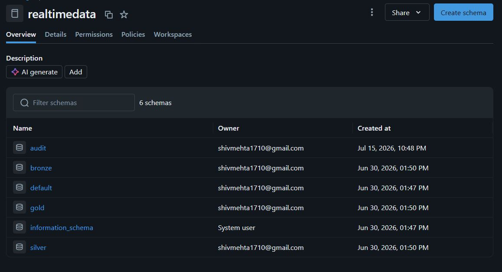

# RealTime_StockMarket_Data

# 🚀 Real-Time Stock Market Data Lakehouse using Kafka, AWS S3, Databricks & Delta Lake


## 📌 Project Overview

This project demonstrates an end-to-end real-time stock market data engineering pipeline that ingests live market data from Angel One SmartAPI, streams it through Apache Kafka, stores it in Amazon S3, processes it using Databricks and Delta Lake, and transforms it into analytics-ready datasets using the Medallion Architecture.

The project follows modern Data Engineering best practices including:

- Real-time streaming
- Lakehouse Architecture
- Medallion Data Model
- Delta Lake
- Databricks Workflows
- Data Quality Validation
- Scalable Cloud Storage

---

### Pipeline Flow

```
Angel One SmartAPI
        │
        ▼
Python Producer
        │
        ▼
Apache Kafka
        │
        ▼
Python Consumer
        │
        ▼
Amazon S3 (Bronze)
        │
        ▼
Databricks
        │
 Bronze → Silver → Gold
        │
        ▼
Analytics Ready Data
```

---

# 🥉🥈🥇 Medallion Architecture


### Bronze Layer

- Raw Market Data
- Stored as Partitioned Parquet
- Immutable Data
- Source of Truth

### Silver Layer

- Data Cleansing
- Schema Validation
- Duplicate Removal
- Data Standardization

### Gold Layer

- Business Aggregations
- OHLC
- Latest Prices
- Moving Average
- Daily High / Low
- Market Performance

---

# 🔄 Databricks Workflow (DAG)


### Job Execution Order

```
01_bronze_ingestion
        │
02_bronze_validation
        │
03_bronze_to_silver
        │
04_silver_validation
        │
 ├──────────────┬──────────────┐
 │              │              │
 ▼              ▼              ▼
Latest Price   OHLC      Moving Average
               │
               ▼
Daily High/Low
               │
               ▼
Market Performance
               │
               ▼
Delta Optimization
```

---

# 📂 Repository Structure

```
RealTime_StockMarket_Data
│
├── config/
├── producer/
├── consumer/
├── databricks/
│   ├── bronze/
│   ├── silver/
│   ├── gold/
│   └── optimization/
│
├── docs/
│   ├── architecture.png
│   ├── medallion_architecture.png
│   ├── workflow.png
│   └── screenshots/
│
├── docker-compose.yml
├── requirements.txt
└── README.md
```
# Installation
# ▶️ How to Run the Project

## Step 1: Clone the Repository

```bash
git clone https://github.com/shivamm111/RealTime_StockMarket_Data.git
cd RealTime_StockMarket_Data
```

---

## Step 2: Create a Virtual Environment

```bash
python -m venv .venv
```

---

## Step 3: Activate the Virtual Environment

### Windows

```bash
.venv\Scripts\activate
```

### Linux / macOS

```bash
source .venv/bin/activate
```

---

## Step 4: Install Dependencies

```bash
pip install -r requirements.txt
```

---

## Step 5: Configure Credentials

Update the following files with your own credentials:

```
config/
├── angelone_config.py
└── aws_config.py
```

Configure:

- Angel One API Key
- Client ID
- PIN
- TOTP Secret
- AWS Access Key
- AWS Secret Key
- AWS Region
- S3 Bucket Name

---

## Step 6: Start Apache Kafka

```bash
docker compose up -d
```

Verify Kafka is running:

```bash
docker ps
```

Expected running container:

```
kafka
```

---

## Step 7: Start the Python Producer

Open **Terminal 1** in VS Code.

Activate the virtual environment if needed.

Run:

```bash
python producer/angel_websocket_v2.py
```

This producer connects to Angel One SmartAPI and publishes live market data to the Kafka topic `market_ticks`.

Leave this terminal running.

---

## Step 8: Start the Kafka Consumer

Open **Terminal 2** in VS Code while keeping the producer running.

Run:

```bash
python -m consumer.kafka_to_s3
```

The consumer:

- Reads messages from Kafka
- Batches incoming records
- Converts them to Parquet
- Uploads the files to the Bronze layer in Amazon S3

---

## Step 9: Verify Data in Amazon S3

Verify that Parquet files are being uploaded to:

```
bronze/
    year=YYYY/
    month=MM/
    day=DD/
```

---

## Step 10: Execute the Databricks Pipeline

### Option 1 (Recommended)

Run the Databricks Workflow.

### Option 2

Execute the notebooks manually in the following order:

1. 01_bronze_ingestion
2. 02_bronze_validation
3. 03_bronze_to_silver
4. 04_silver_validation
5. 05_gold_latest_prices
6. 06_gold_ohlc_1min
7. 07_gold_moving_average
8. 08_gold_daily_high_low
9. 09_gold_market_performance
10. 10_delta_optimization

---

## Step 11: Verify Gold Layer Outputs

After the workflow completes successfully, verify the following Gold datasets:

- Latest Prices
- OHLC (1 Minute)
- Moving Average
- Daily High /Low
- Market Performance

---

## Project Execution Flow

```
Clone Repository
        │
        ▼
Create Virtual Environment
        │
        ▼
Install Dependencies
        │
        ▼
Configure API & AWS Credentials
        │
        ▼
Start Kafka (Docker)
        │
        ▼
Run Producer (angel_websocket_v2.py)
        │
        ▼
Kafka Topic (market_ticks)
        │
        ▼
Run Consumer (kafka_to_s3.py)
        │
        ▼
Amazon S3 (Bronze Layer)
        │
        ▼
Run Databricks Workflow
        │
        ▼
Bronze → Silver → Gold
        │
        ▼
Analytics Ready Data
```
---

# ⚙️ Technology Stack

| Category | Technology |
|----------|------------|
| Programming | Python |
| Streaming | Apache Kafka |
| Data Lake | Amazon S3 |
| Processing | Apache Spark |
| Lakehouse | Delta Lake |
| Platform | Databricks |
| Orchestration | Databricks Workflows |
| Data Format | Parquet |
| Version Control | Git & GitHub |

---

# 📊 Gold Layer Outputs

The pipeline produces the following analytics-ready datasets:

- Latest Stock Prices
- 1 Minute OHLC Candles
- Moving Averages
- Daily High / Low
- Market Performance

---

# 📸 Screenshots

## Bronze, Silver, Gold Layers:


---

# 🚀 Future Enhancements

- Apache Airflow Orchestration
- Real-time Alerts
- Power BI Dashboard
- CI/CD Pipeline
- Unit Testing
- Data Quality Monitoring
- Infrastructure as Code (Terraform)

---

# 👨‍💻 Author

**Shivam Mehta**

Data Engineering Project

---

# ⭐ If you found this project useful, consider giving it a Star!
