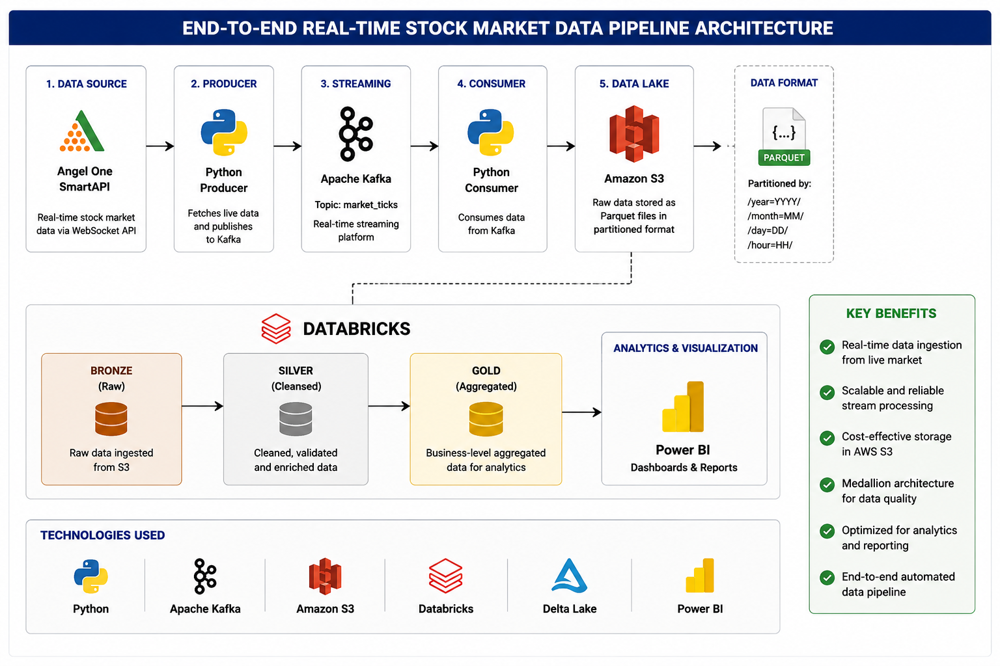
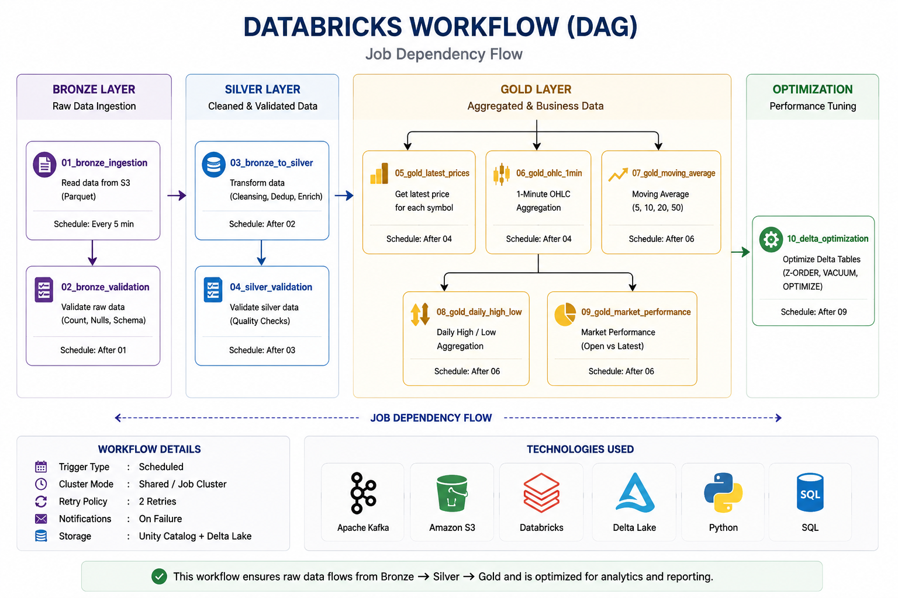

# RealTime_StockMarket_Data

# 🚀 Real-Time Stock Market Data Lakehouse using Kafka, AWS S3, Databricks & Delta Lake



## 📌 Project Overview

This project demonstrates an end-to-end real-time stock market data engineering pipeline that ingests live market data from Angel One SmartAPI, streams it through Apache Kafka, stores it in Amazon S3, processes it using Databricks and Delta Lake, and transforms it into analytics-ready datasets using the Medallion Architecture.

The project follows modern Data Engineering best practices including:

- Real-time streaming
- Lakehouse Architecture
- Medallion Data Model
- Delta Lake
- Databricks Workflows
- Data Quality Validation
- Scalable Cloud Storage

---

### Pipeline Flow

```
Angel One SmartAPI
        │
        ▼
Python Producer
        │
        ▼
Apache Kafka
        │
        ▼
Python Consumer
        │
        ▼
Amazon S3 (Bronze)
        │
        ▼
Databricks
        │
 Bronze → Silver → Gold
        │
        ▼
Analytics Ready Data
```

---

# 🥉🥈🥇 Medallion Architecture


### Bronze Layer

- Raw Market Data
- Stored as Partitioned Parquet
- Immutable Data
- Source of Truth

### Silver Layer

- Data Cleansing
- Schema Validation
- Duplicate Removal
- Data Standardization

### Gold Layer

- Business Aggregations
- OHLC
- Latest Prices
- Moving Average
- Daily High / Low
- Market Performance

---

# 🔄 Databricks Workflow (DAG)



### Job Execution Order

```
01_bronze_ingestion
        │
02_bronze_validation
        │
03_bronze_to_silver
        │
04_silver_validation
        │
 ├──────────────┬──────────────┐
 │              │              │
 ▼              ▼              ▼
Latest Price   OHLC      Moving Average
               │
               ▼
Daily High/Low
               │
               ▼
Market Performance
               │
               ▼
Delta Optimization
```

---

# 📂 Repository Structure

```
RealTime_StockMarket_Data
│
├── config/
├── producer/
├── consumer/
├── databricks/
│   ├── bronze/
│   ├── silver/
│   ├── gold/
│   └── optimization/
│
├── docs/
│   ├── architecture.png
│   ├── medallion_architecture.png
│   ├── workflow.png
│   └── screenshots/
│
├── docker-compose.yml
├── requirements.txt
└── README.md
```

---

# ⚙️ Technology Stack

| Category | Technology |
|----------|------------|
| Programming | Python |
| Streaming | Apache Kafka |
| Data Lake | Amazon S3 |
| Processing | Apache Spark |
| Lakehouse | Delta Lake |
| Platform | Databricks |
| Orchestration | Databricks Workflows |
| Data Format | Parquet |
| Version Control | Git & GitHub |

---

# 📊 Gold Layer Outputs

The pipeline produces the following analytics-ready datasets:

- Latest Stock Prices
- 1 Minute OHLC Candles
- Moving Averages
- Daily High / Low
- Market Performance

---

# 📸 Screenshots

## Databricks Workspace

*(Add image later)*

## Bronze Layer

*(Add screenshot later)*

## Silver Layer

*(Add screenshot later)*

## Gold Layer

*(Add screenshot later)*

## Workflow Execution

*(Add screenshot later)*

---

# 🚀 Future Enhancements

- Apache Airflow Orchestration
- Real-time Alerts
- Power BI Dashboard
- CI/CD Pipeline
- Unit Testing
- Data Quality Monitoring
- Infrastructure as Code (Terraform)

---

# 👨‍💻 Author

**Shivam Mehta**

Data Engineering Project

---

# ⭐ If you found this project useful, consider giving it a Star!
